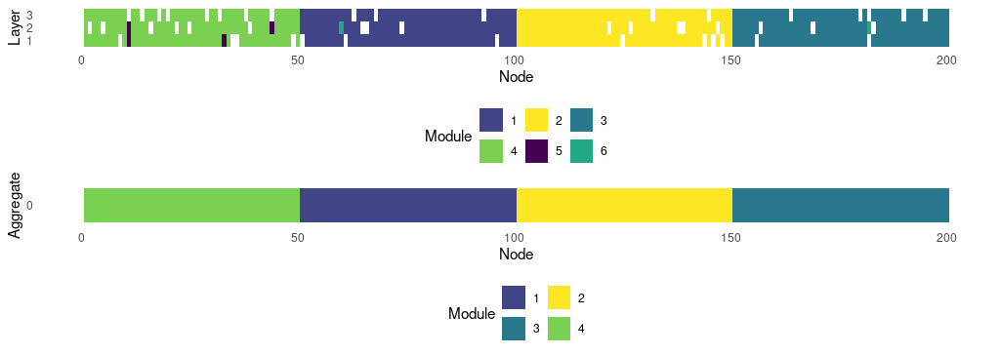

# muxViz v3.1: The R package

## Major changes

**v3.1** is the latest and is continuously updated. It is an R package (still in development, not on CRAN) which can be installed in R by

```R
devtools::install_github("manlius/muxViz")
```

In case of anomalous/unexpected behavior, please report it to the dedicated [Google Group](https://groups.google.com/forum/#!forum/muxviz). Note that emails to personal address might remain unanswered. 
For more information, read the main [README](./README.md).

The R package allows to use muxViz from R without 

* requiring to source script files (v3.0) or
* requiring to pass from any GUI, which is left for v2.0. 

If you want to use v3.1 you should:

* Download and install R. Note that the data analysis would benefit from the enhanced R environment developed by Microsoft: it is strongly recommended to download and install Microsoft R Open from

<https://mran.microsoft.com/download/>

* TODO: compile [infomap]() e [fanmod]() and save the paths of their executables.

* install (if you do not have it yet) `devtools`, i.e., `install.packages("devtools")`

* install `muxViz` as follows: `devtools::install_github("manlius/muxViz")`


# muxViz v3.0 (T'Challa): The standalone libray

## Major changes

**v3.0: The Standalone Library**. v3.0 is not based on a GUI, which is left for v2.0, and allows to use `muxViz` fully from R scripts (with `igraph`and `ggplot2` packages, for instance). If you want to use v3.0 you should:

* Download and install R. Note that the data analysis would benefit from the enhanced R environment developed by Microsoft: it is strongly recommended to download and install Microsoft R Open from

<https://mran.microsoft.com/download/>

* TODO: compile infomap e fanmod

* manually download muxViz or clone it:

	`git clone https://github.com/manlius/muxViz`

* download and install the required (or useful) dependencies with:

```R
dependencies_pkgs <- c("Matrix", "RSpectra", "tidyverse", "GGally", "compiler", "ggraph", 
                       "tictoc", "rgl", "igraph", "RColorBrewer", "viridis", "corrplot")
#                       
for (pkg in dependencies_pkgs) {
	install.packages(pkg)
}
```
		
* set the work directory to the `standalone` folder by
  
  `setwd("/user/path/muxviz/standalone")`

Then include the following header in your scripts:

	`source("muxLib.R")`

or directly source the library from your current working directory:

	`source("/user/path/muxviz/standalone/muxLib.R")`

To speed up your interaction with muxViz, the folder `standalone` contains some self-explanatory example scripts which show how to use the most salient analytical techniques available in the library:

* `community_detection.R`
* `connected_components.R`
* `example_coverage_optimized.R`
* `example_coverage.R`
* `example_overlapping_generator.R`
* `example_plot_edgecolored_heatmap_6panels.R`
* `example_plot_edgecolored_paths_coupling.R`
* `example_plot_edgecolored_paths.R`
* `example_plot_edgecolored.R`
* `example_transitivity_new.R`
* `layer-layer_corr.R`
* `multi_motifs.R`

Note that to work properly, you must (manually, for the moment) compile `fanmod` and `Infomap` on your system, and move the binaries in the `standalone folder`. 

Typical outputs are:





Unfortunately, at this stage, documentation is still poor and requires some time.

## File format

There is no specific file format required in this version, since the user is allowed to freely manipulate the data to create the desired input, usually in form of igraph objects or supra-adjacency matrices. See the examples for details. 


# muxViz v2.0


The current implementation exploits a Graphical User Interface (working with any browser) to provide access to many customizable graphic options to render networks.

### muxViz v0.1 (CLI)

Usage from shell command line (no support to GUI and no longer developed):

	R CMD BATCH muxViz_CLI.R

If used with the default options for the first time, muxViz will plot a multiplex with 100 nodes and 4 layers with community-like topology. The output should be a file 'muxViz.png' in the same folder, similar to 'muxViz_example.png' provided with the package.

Please, explicitly cite muxViz if you find it useful for your visualizations.

If you use muxVizGUI for your data analysis, please, cite the relevant papers where all descriptors and diagnostics are defined: you will find a quick help with references to relevant papers in all pages dedicated to data analysis.


### monoxViz v0.1 (CLI)

Support the visualization of classical single-layer networks (no longer developed).

The muxViz package now includes a script for the visualization of standard networks. It supports both 2D and 3D layouting with openGL, it is fully integrated with OpenStreetMap and preserves all the features developed to customize visualizations with muxViz.
